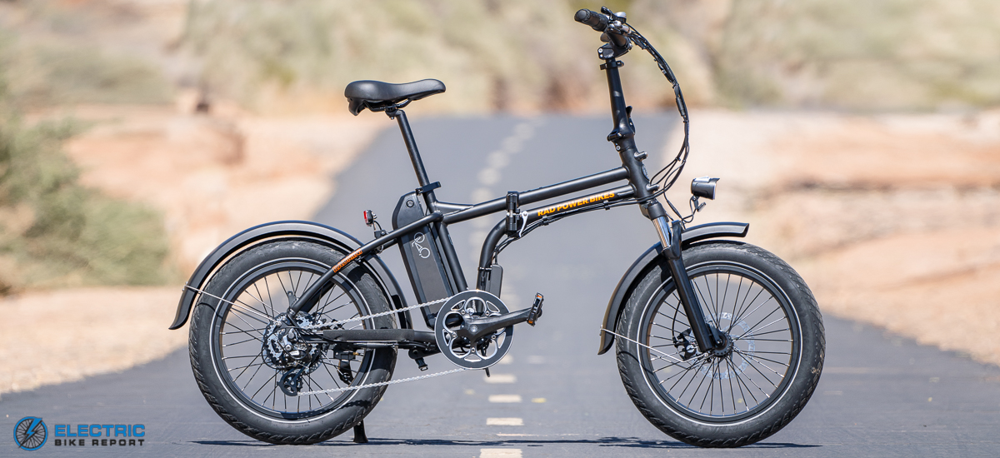

While I love the 20x4 fat bike ecosystem, they're very often quite non-portable. In wanting something that would be easier to take places, I set my sights on a RadMini4, 2019 edition.

I picked up a _very_ used one for a reduced price of $500. This is fine as I plan a whole host of upgrades:

- 72v Dual Battery Setup
- Controller upgrade to Grin Phaserunner + Cycle Analyst
- Motor Upgrade Bafang G062 (or similar)
- Better tires (my goodness, the stock tires are SO noisey!)

There will certainly be lots of other little odds and ends during the upgrade process, but for the most part these are the bit ticket items.