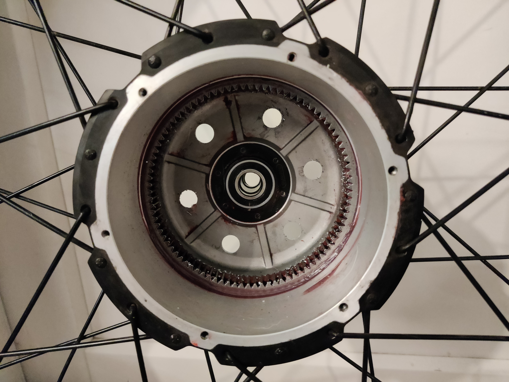

As part of upgrading my recently acquired RadMini4 (2019), I wanted a beefier, torquier, and faster motor.

While most would jump to the [Bafang G062](https://ebikes.ca/shop/electric-bicycle-parts/motors/mg62_170.html), which is undoubtedly a great way to go, I happened across a relatively new offering from MXUS called the XF19FAT.

This motor promises a sustained 1200w and a *peak* **1500w** under its a 1:5 gear reduction.

I ordered directly from [MXUS via Alibaba](https://mxus.en.alibaba.com/) from [this particular offering page](https://www.alibaba.com/product-detail/high-torque-48v-1500w-electric-bike_1600591696849.html). The representive I made the order arrangement with was professional, answered all my questions precisely and quickly and had the order in my hands far faster than I expected.

I was able to ask for it to be customized as well; I added a NTC10k temp probe and got it mounted in a 20" fat tire rim.

My out-the-door cost, including shipping, was $340 -- a steal of deal, if you ask me.

The only complaint I have is that they are using one of these red Julet connectors instead of HiGO L10 motor connectors; just means I need to solder up an adapter from a spare cord (which they also included at my asking).

One of the things that sets this apart, in my eyes, is the very wide stator:

That is 150mm in diameter; which I'm pretty sure is a fair bit larger than most other motors. Here's how I know:

The ring and gearset are the same size as other motors in this class, but you can clearly see the outer shell requires a good deal more room to accommodate the motor housing. Here's a G062 for example, care of [ToumasK on Endless-sphere](https://endless-sphere.com/sphere/threads/anyone-using-bafang-g062-1000-1000w-geared-hub-motor.109866/page-2#post-1709021):

Much smaller. This addition stator width is likely how the motor is going to handle the higher wattage rating.

I was able to successfully connect this to a Frankenrunner with some temporary Wago connectors acting as a bridge between L10 and JuletRed connector. Here's some of my initial tuning parameters:

* Effective pole pairs: 75
  * 30 Magnets
  * 1:5 Gear reduction
  * (15 pairs * 5)
* RPM/v ~9.3
* Motor temp sensor `NTC10k - B3950`
* Connect white wire on motor (combined temp and speed) to Gray wire on L10 connector (temp) _(Phaserunner/frankenrunner will see the combined signal on the temp wire and extract the dual information)_
* Phase and hall wires all match up in the expected colors and are identical across cables

With all that in place you should be should be all set to autotune and let'r rip.

On the bench, this was pushing 640rpm which, at 20" _(typically 24" in actual diameter)_ means the tire would be [rolling along at about 45mph](https://www.omnicalculator.com/everyday-life/rpm?c=USD&v=Engine_RPM:640!rpm,Drivetrain_Transmission_Ratio:1,Tire_Diameter:24!inch)! Keep in mind, I'm running a 72v system and under real load, on the bike and with rider, I expect sub-40's. However, since all I'm really after is mid-30's to keep pace with traffic when needed _(which is a lot in the US...)_, I expect I'll be a happy camper. 

I'm also looking forward to being able to dump some serious amps into this thing and see how it fares on my torture test hill with the supposed 120nm of torque.

Time to get it mounted up and tried out over the next few days.
